# Magento 2 - Debug module
Module for debugging Magento 2 performance. It works without overwriting any core files and it can be installed with composer.

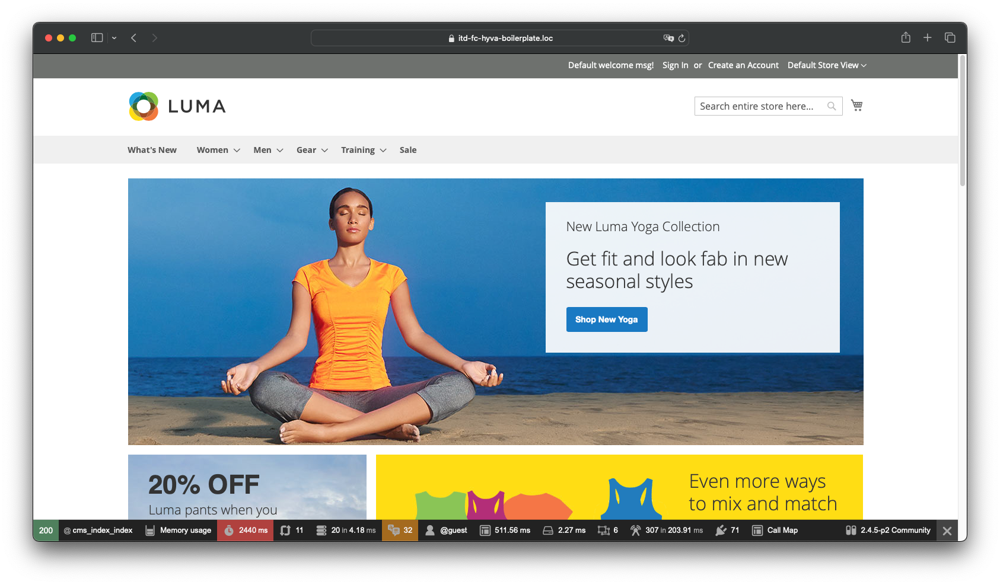

#### The module supports Hyva Theme!

#### Important - the module is not intended to work in a production environment!
## Installation
1. Enable developer mode `php bin/magento deploy:mode:set developer`
2. Install module via composer `composer require daseraf/magento2-debug`
3. Register module `php bin/magento setup:upgrade`
4. Enable profiler in configuration: `Stores -> Configuration -> Advanced -> Debug`
5. Clear cache `php bin/magento c:c`

# If you want to see Callmap
For this functionality you will need to install the xhprof extension for your PHP interpreter
I recommend using PECL for these purposes.
https://pecl.php.net/package/xhprof

## Enable Callmap collector
> pecl install xhprof
### Xhprof extension configuration
Just enable extension:
> extension=xhprof.so

Xhprof flags are set from the Magento admin panel
> Advanced -> Debug -> Data collectors -> Xhprof Flags

# If you want to monitor queries to the database, run this command
> php bin/magento debug:db-profiler:enable

This will add a profiler flag to the database section of the env.php file

## To disable use the following command:
> php bin/magento debug:db-profiler:disable

## Compatibility
* Magento 2.2 - 2.4
* PHP 7.0 - 8.1

## Profiler collectors
- Ajax - Please note that you can profile any requests coming into the platform, such as adding to cart
  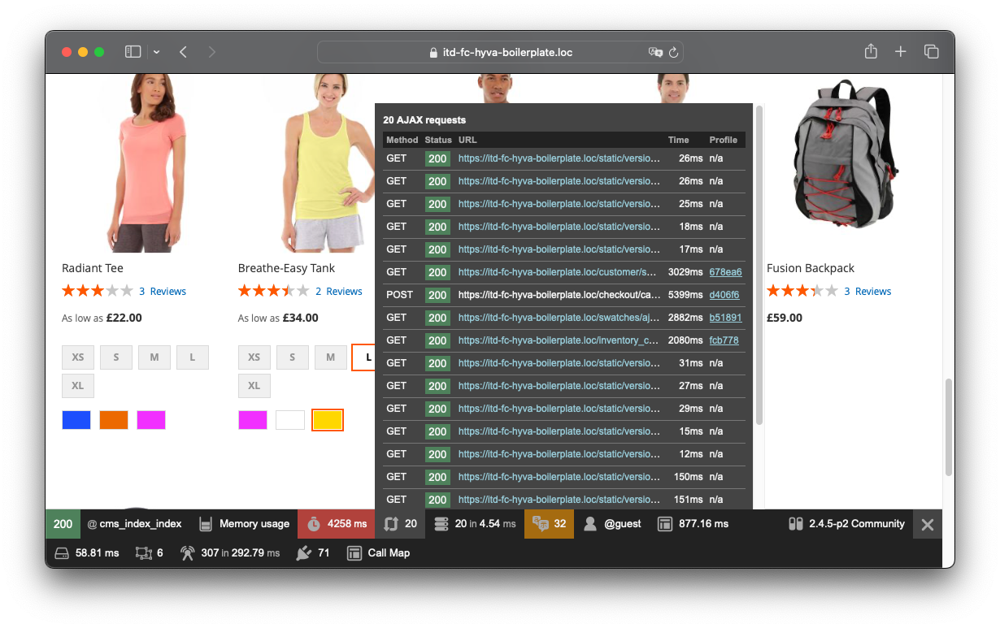
- Call map - Shows the time spent performing each function. [XHprof extension required](https://www.php.net/manual/en/book.xhprof.php)
  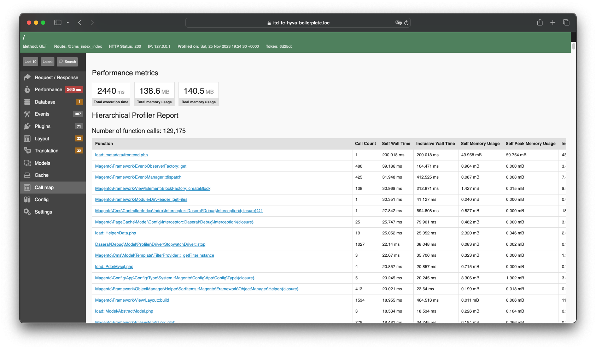
  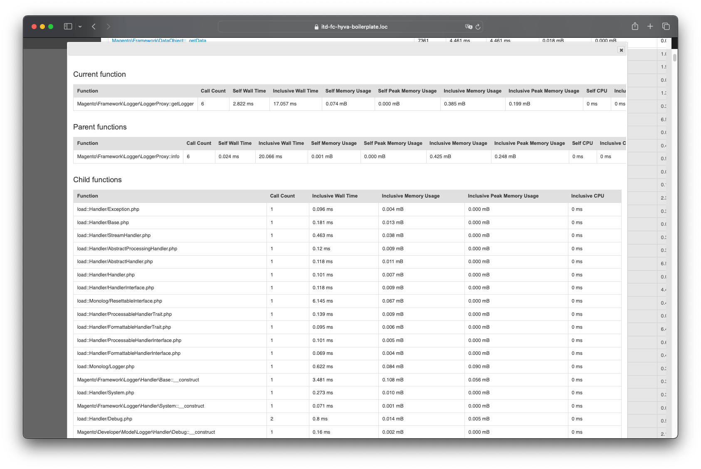
- Database - Database queries and variable values
  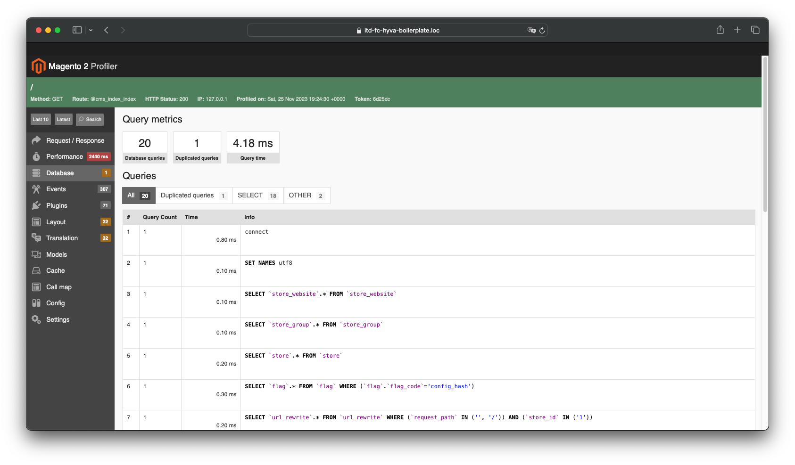
- Events - Displays all sent events as well as the observers tracking them
  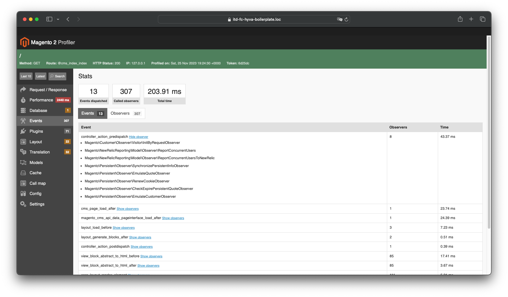
- Layout - Displays a list of blocks and the time spent on rendering them
  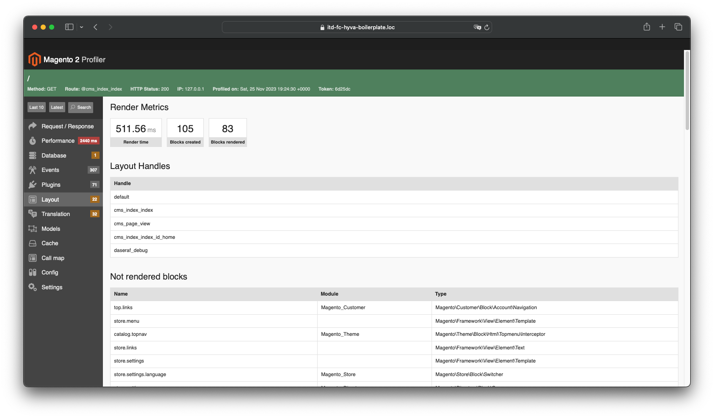
- Layout Rendering analysis (Layout tab) - Detailed information on each block and caching status for them.
  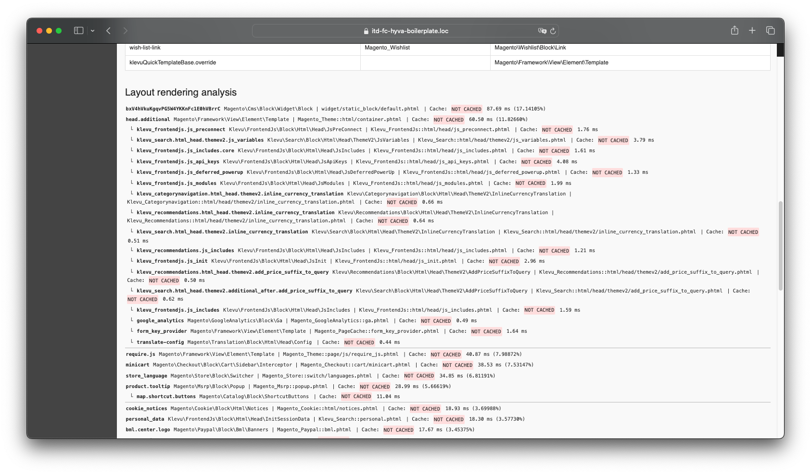
#### Attention - if you see that blocks are not cached, this is not a debugger error! Please make sure your block has cache_lifetime.
- Models - Displays loaded entity modules and the number of reloads without accessing the cache
  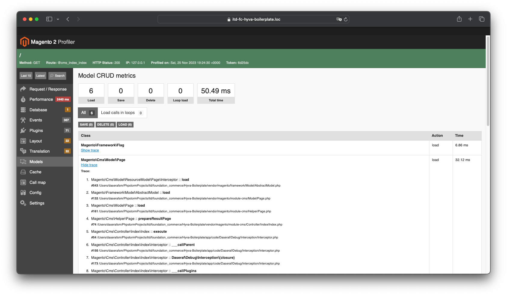
- Plugins - Shows the plugins that were called during the process, as well as the time spent on their work. Attention - the execution time of around plugins includes the execution time of all functions that will be called in the body of the plugin. Is not an error
  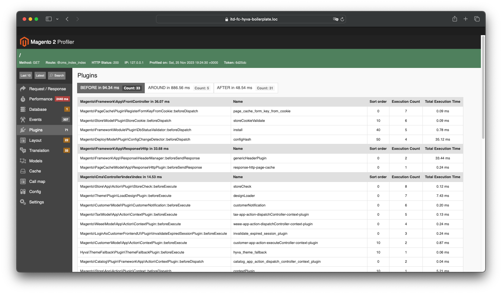
- Translations - here you can see all messages for which translation is missing
  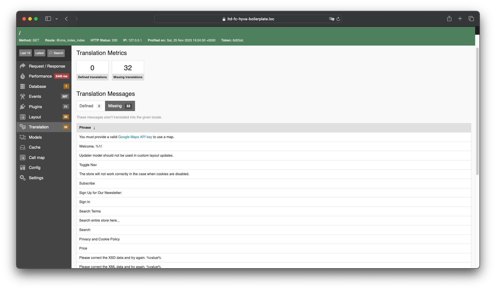
- Cache (Status and Calls) - This tab displays all successful cache calls (cacheKey is displayed in the table)
  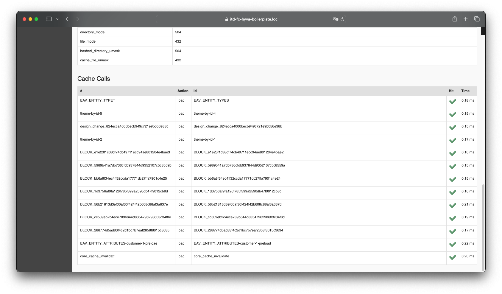
- Performance - here you can find a graph that is based on the output of the standard profiler from magento
  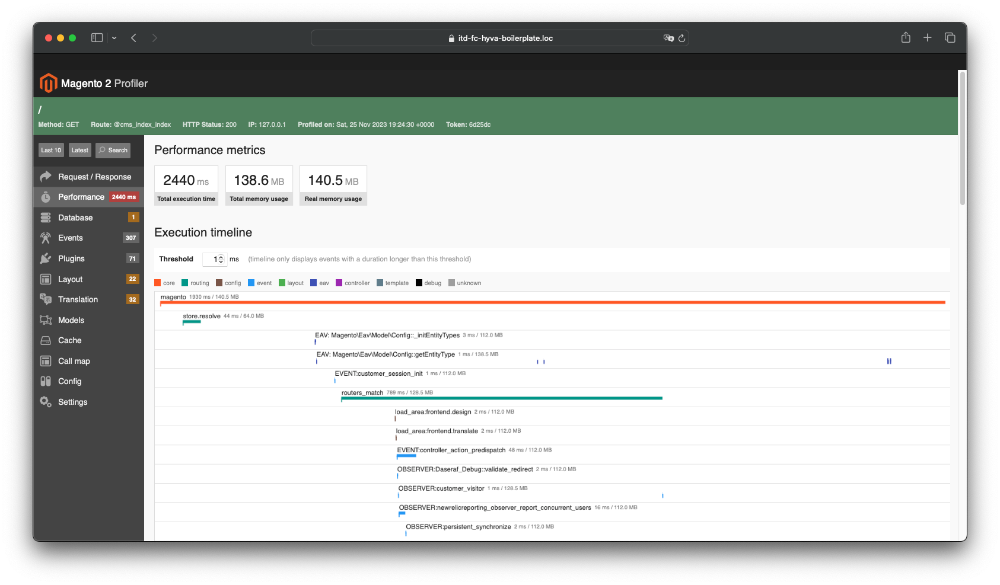
- Request/Response
  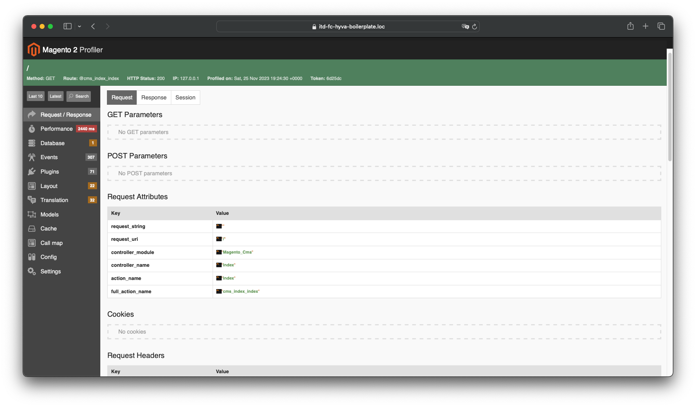
- Config
  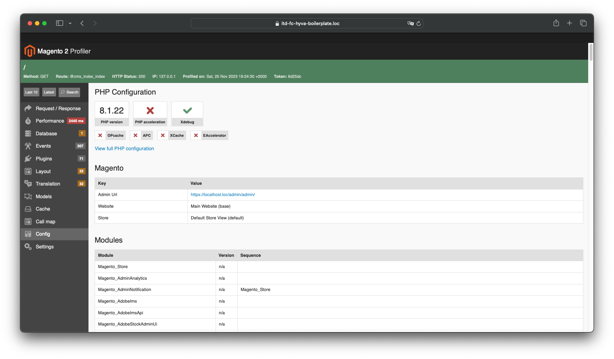
- Memory
  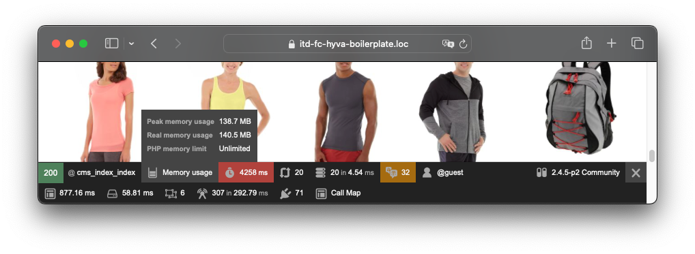

## Additional features
- [Whoops error handler](http://filp.github.io/whoops/)

## Credits
- [Magento 2.x Web Profiler](https://github.com/clawrock/magento2-debug)
- [Magento 1.x Web Profiler](https://github.com/ecoco/magento_profiler)
- [Symfony WebProfilerBundle](https://github.com/symfony/web-profiler-bundle)
